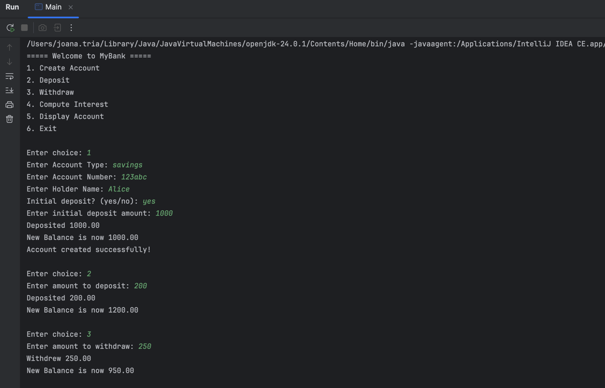
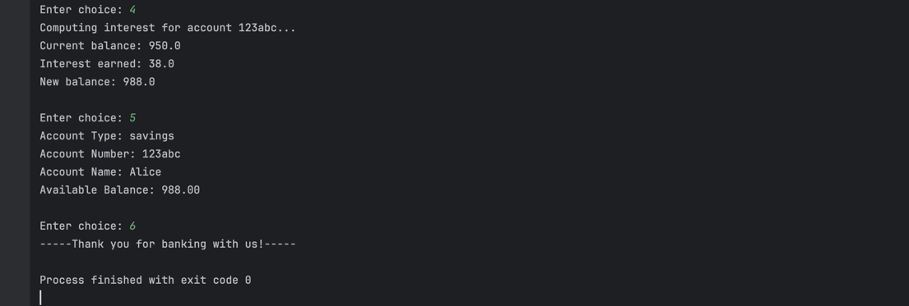
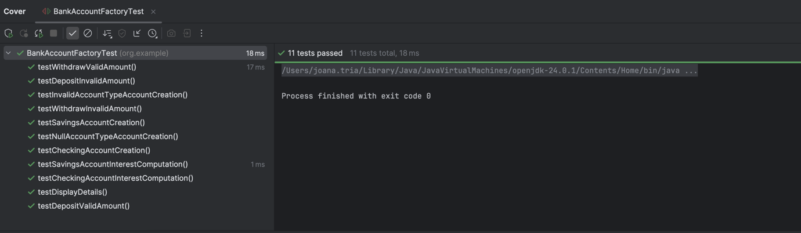
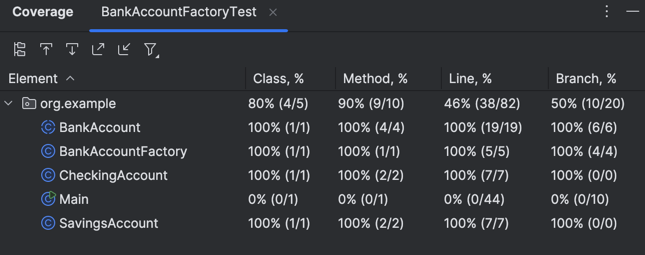

## Group 6:
1. Marvin Andrew Rosales
2. John Robert Siglos
3. Joana Tria

# Lab 3: Java OOP Capstone Project
Using the factory method design pattern, we implemented the Banking System which has 3 classes, namely the abstract class BankAccount, 
and subclasses CheckingAccount and SavingsAccount. We then created a BankAccountFactory which creates the two types of bank accounts: 
Savings and Checking. In our main method, we have a menu which provides the users with options to create an account, deposit and withdraw,
compute for interest, display account information, and exit from the program. The checking account has an interest of 1% while the savings
account has 4%.

### Output:

Then using the JUnit5, we created 11 test cases handling all possible valid and invalid inputs for our BankAccount class. 
### Test Case with Coverage

